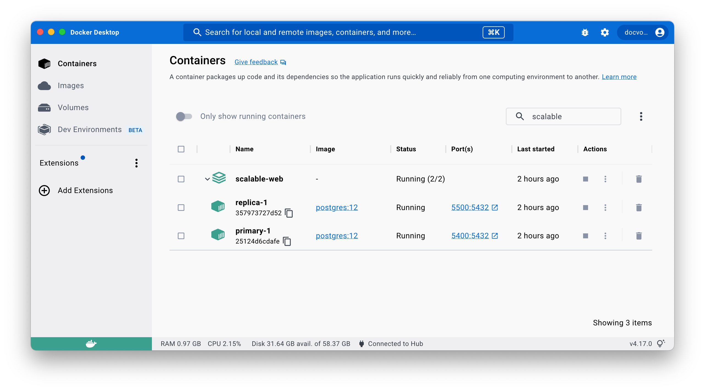
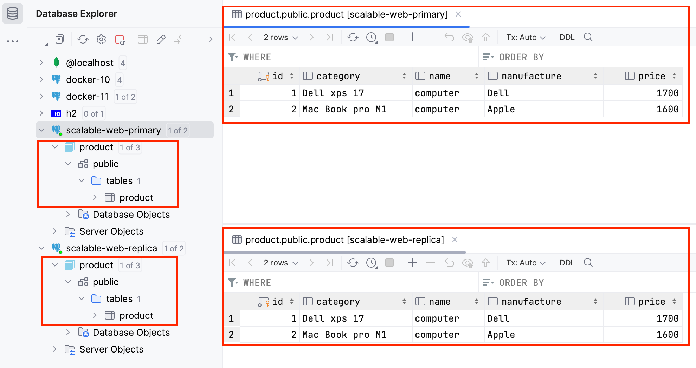

# load balancing web

## Architecture

<div style="text-align: center;">
    
</div>

## Database

### 1. Setup Postgres database
Set up 2 postgres database in 2 docker container
Use docker compose

```yaml
version: "3.8"
# Create a docker network
networks:
  my_lan:
    driver: bridge
    ipam:
      config:
        - subnet: 192.168.0.0/24
          gateway: 192.168.0.5
services:
  primary:
    image: bitnami/postgresql:14.7.0
    networks:
      my_lan: #Assign network
        ipv4_address: 192.168.0.10
    deploy:
      restart_policy:
        condition: none
    environment:
      - POSTGRESQL_REPLICATION_MODE=master
      - POSTGRESQL_USERNAME=boss
      - POSTGRESQL_PASSWORD=123456
      - POSTGRESQL_DATABASE=product
      - POSTGRESQL_REPLICATION_USER=replica_user
      - POSTGRESQL_REPLICATION_PASSWORD=r123456
    ports:
      - "5400:5432"
  replica:
    image: bitnami/postgresql:14.7.0
    networks:
      my_lan: #Assign network
        ipv4_address: 192.168.0.15
    deploy:
      restart_policy:
        condition: none
    environment:
      - POSTGRESQL_REPLICATION_MODE=slave
      - POSTGRESQL_MASTER_HOST=192.168.0.10
      - POSTGRESQL_MASTER_PORT_NUMBER=5432
      - POSTGRESQL_REPLICATION_USER=replica_user
      - POSTGRESQL_REPLICATION_PASSWORD=r123456
    ports:
      - "5500:5432"
```
So we will have 2 database server **primary** and **replica** up and running when call

```
docker compose up
```

View from [Docker Desktop](https://www.docker.com/products/docker-desktop/)

<div style="text-align: center;">
    
</div>

### 2. Config replication

talk about bitnami

#### 2.1 Primary database
- POSTGRESQL_REPLICATION_MODE=master
- POSTGRESQL_USERNAME=boss
- POSTGRESQL_PASSWORD=123456
- POSTGRESQL_DATABASE=product
- POSTGRESQL_REPLICATION_USER=replica_user
- POSTGRESQL_REPLICATION_PASSWORD=r123456

#### 2.2 Replica database
- POSTGRESQL_REPLICATION_MODE=slave
- POSTGRESQL_MASTER_HOST=192.168.0.10
- POSTGRESQL_MASTER_PORT_NUMBER=5432
- POSTGRESQL_REPLICATION_USER=replica_user
- POSTGRESQL_REPLICATION_PASSWORD=r123456

we don't define POSTGRESQL_USERNAME and POSTGRESQL_PASSWORD in replica database, when login to replica database, we can use user boss from primary database

#### 2.3 Test connection and data stream
From primary instance, create new table and insert some record

```sql
CREATE TABLE product
(
    id          INT NOT NULL PRIMARY KEY,
    category    VARCHAR(100),
    name        VARCHAR(100),
    manufacture VARCHAR(50),
    price       REAL
);

INSERT INTO product values (1,'Dell xps 17', 'computer', 'Dell', 1700);
INSERT INTO product values (2,'Mac Book pro M1', 'computer', 'Apple', 1600);
```
Check replica server if new table is streamed

<div style="text-align: center;">
    
</div>

## Web application
### Multi datasource route
### Build docker image
## Load balancer
### Nginx
### Ip check
## Load Test with Gatling
### 

