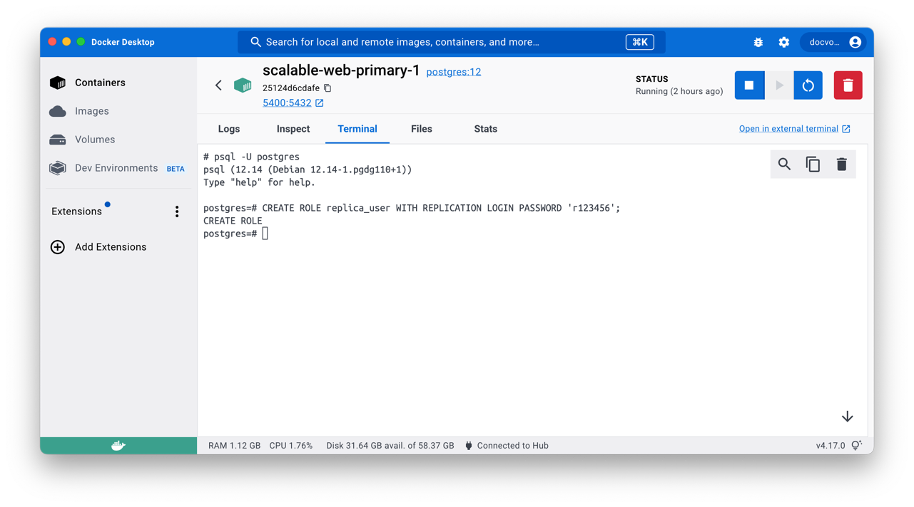
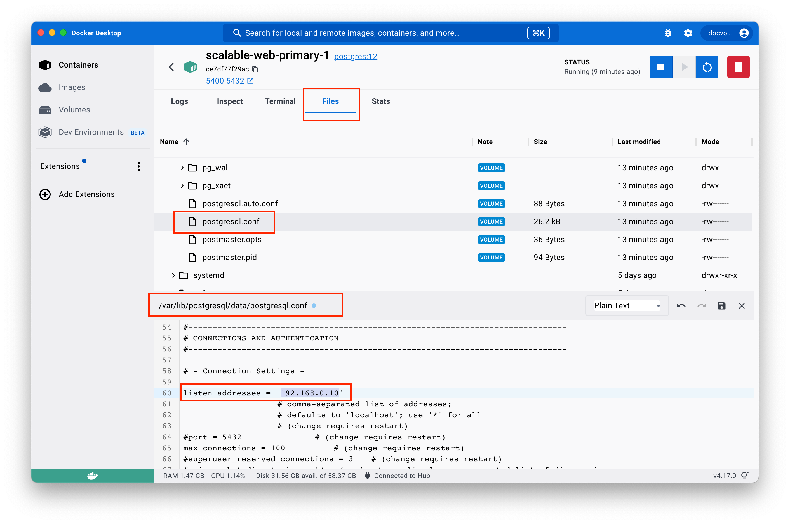
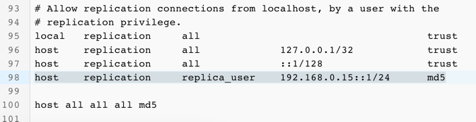

### 2. Config replication
#### 2.1 Primary database

Create user for replica db to connect to primary db

> We can use terminal on Docker Desktop for quick interactive docker container instead of execute #docker exec on os terminal

> To use psql, type "psql -U postgres"
```sql
CREATE ROLE replica_user WITH REPLICATION LOGIN PASSWORD 'r123456';
```
<div style="text-align: center;">
    
</div>

Update **/var/lib/postgresql/data/postgresql.conf**

Set value
- `listen_address` = '192.168.0.10'
- `wal_level` = logical
- `wal_log_hints` = on

Remember to remove the **#** at the beginning to uncomment the line

<div style="text-align: center;">
    
</div>

Update **/var/lib/postgresql/data/pg_hba.conf**

Append this line to the end of file
It tell postgres to allow connection from replica db (192.168.0.15) via user replica_user

>host    replication     replica_user    192.168.0.15::1/24      md5

<div style="text-align: center;">
    
</div>

Restart container, before go to replica config, i would like to inti some data in primary to demonstrate data copy to replica
```sql
CREATE database product;

CREATE TABLE product
(
    id          INT NOT NULL PRIMARY KEY,
    category    VARCHAR(100),
    name        VARCHAR(100),
    manufacture VARCHAR(50),
    price       REAL
);

INSERT INTO product values (1,'Dell xps 17', 'computer', 'Dell', 1700);
INSERT INTO product values (2,'Mac Book pro M1', 'computer', 'Apple', 1600);
```

#### 2.2 Replica database

Stop postgres service
```
> su
> su postgres
> pg_ctl stop -D $PG_DATA
```


Use psql, execute pg_basebackup,
>pg_basebackup -h 192.168.0.10 -U replica_user -p 5432 -D $PGDATA -Fp -Xs -P -R

>pg_basebackup -h 192.168.0.10 -U replica_user -X stream -C -S replica_1 -v -R -W -D $PGDATA

service postgresql start
- $PGDATA equals **/var/lib/postgresql/data**, it's a environment variable create by postgres

#### 2.3 Test connection and data stream